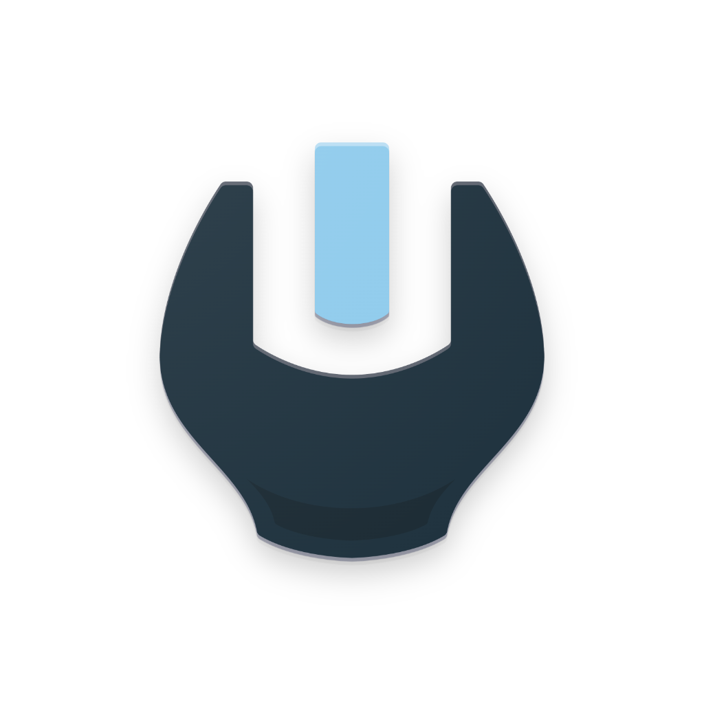
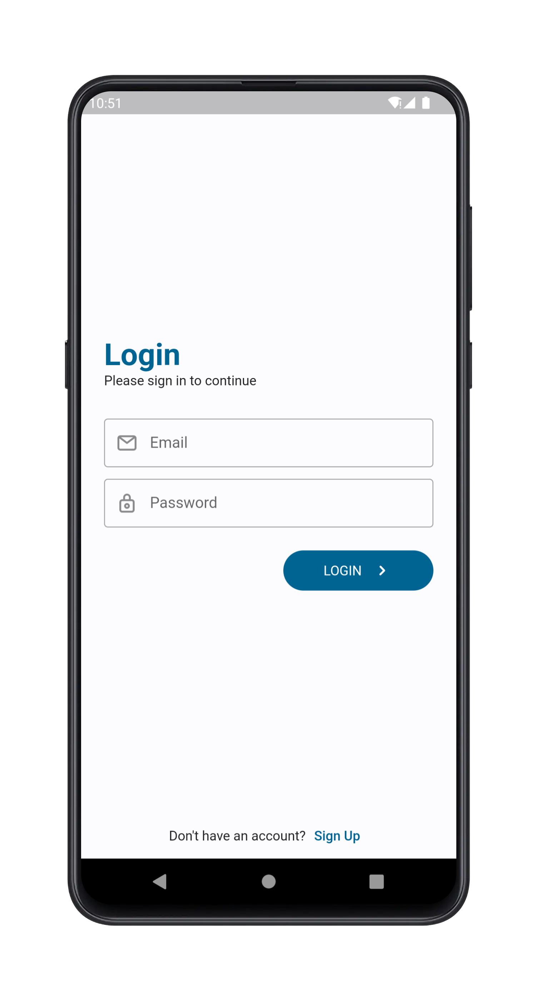
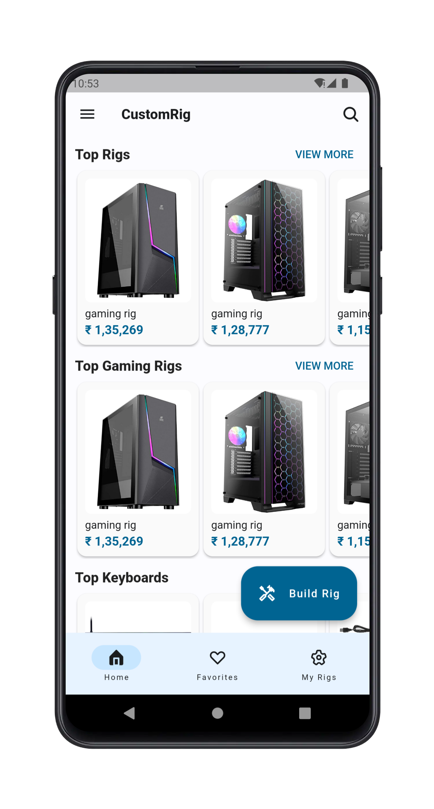
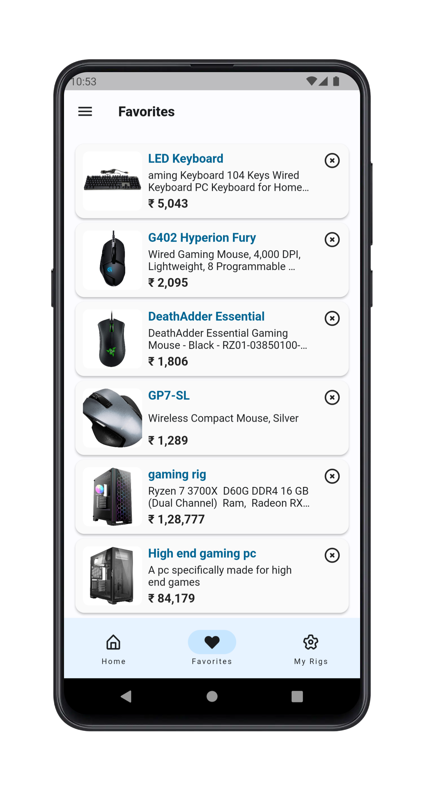
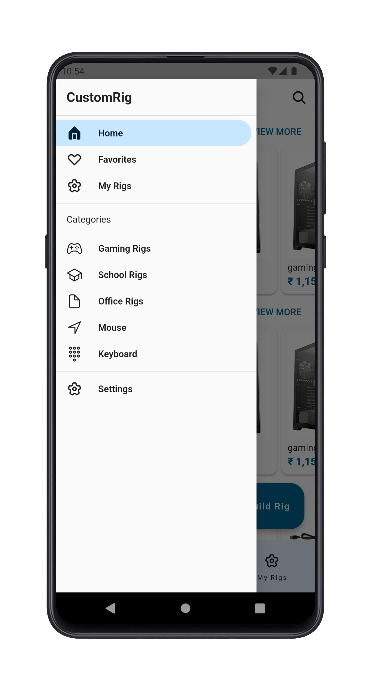
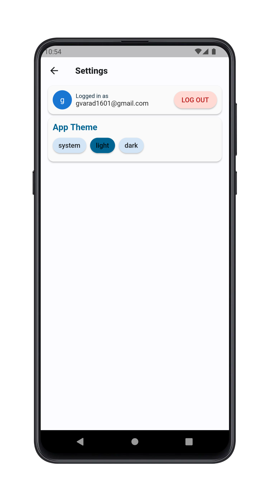
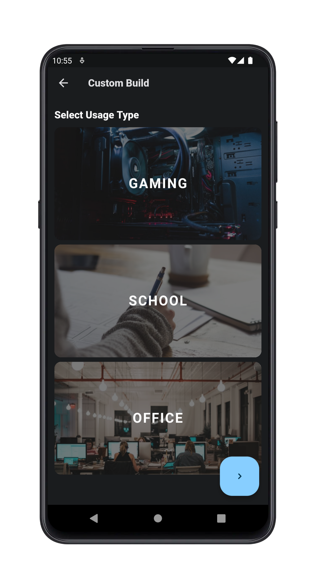
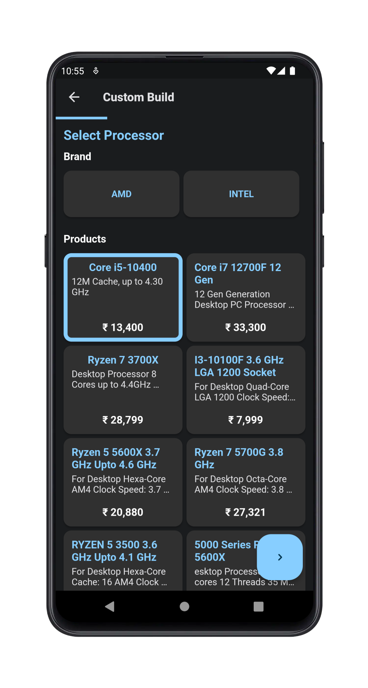

# CustomRig

 

CustomRig is a simple app that helps users to build Custom PC based on their requirements and usage. Users are also provided with pre-builds for different usages and requirements which will save their time instead of building their own custom PC from scratch.

CustomRig app also provides users with the best accessories available in the market which are required for PC setup. So users can easily purchase them directly without searching on large e-commerce websites.

## Screenshots

## Contributing

Found any bugs? Have any suggestions or code improvements? [Submit an issue](https://github.com/CustomRig/customrig/issues) or fork and send a [pull request](https://github.com/CustomRig/customrig/pulls) with your changes. All contributions are more than welcome.

## License

This project is licensed under the MIT License - see the [LICENSE](https://choosealicense.com/licenses/mit/) file for details.
